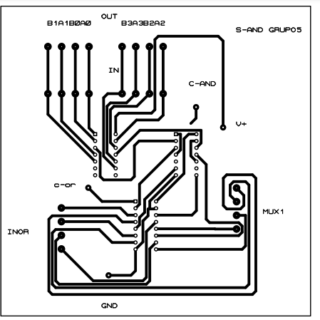
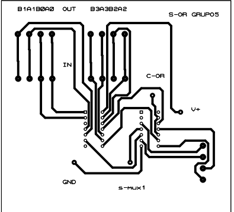
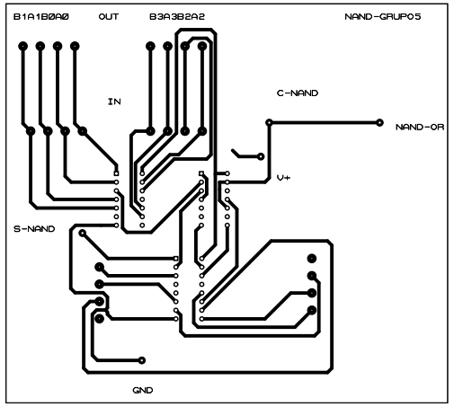
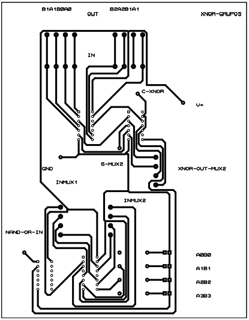
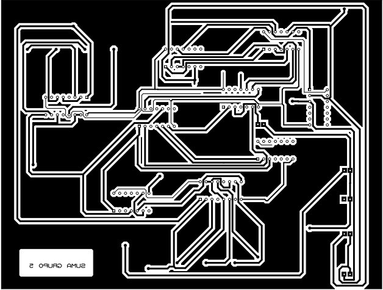
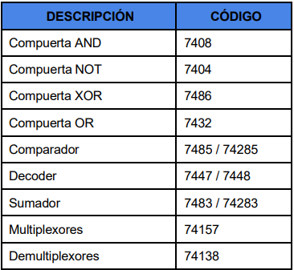
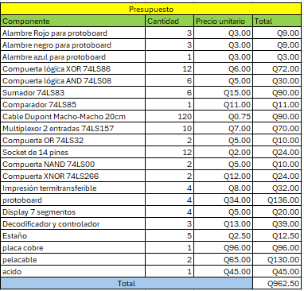

# Documentacion Practica 2 
# Laboratorio Organización Computacional
# Sección C
## Ing. FERNANDO JOSÉ PAZ GONZÁLEZ
## Aux. KEVIN ESTUARDO SECAIDA MOLINA

# Grupo 5

| Nombre                          | Carnet    | Participación |
| --------------------------------| --------- |---------------|
|JOSÉ ADRIAN OROZCO RAMÍREZ       | 202210908 |      20%      |
|---------------------------------|-----------|---------------|
|MARCOS DANIEL BONIFASI DE LEÓN   | 202202410 |      20%      |
| --------------------------------| --------- |---------------|
|KEVIN DANIEL CATÚN LANDAVERDE    | 202200378 |      20%      |
|---------------------------------|-----------|---------------|
|JULIO ALEJANDRO RUANO MONTERROSO | 202300520 |      20%      |
| --------------------------------| --------- |---------------|
|WYLSON ENRIQUE ESQUIVEL CUY      | 202105429 |      20%      |

# Introducción 
En el ámbito de la electrónica digital, el diseño y la implementación de circuitos combinacionales juegan un papel fundamental en la construcción de sistemas computacionales eficientes. En particular, la integración de bloques MSI (Medium Scale Integration) en operaciones aritméticas y lógicas permite la creación de dispositivos con una funcionalidad optimizada y de alto rendimiento.

La presente práctica tiene como objetivo desarrollar una Unidad Aritmética Lógica (ALU) básica mediante el uso exclusivo de lógica combinacional. Para ello, se diseñará e implementará un prototipo de calculadora denominado LogicCalc, el cual será capaz de realizar operaciones aritméticas, lógicas y comparativas sobre números binarios de 4 bits. Se busca, además, minimizar el número de componentes utilizados, garantizando una solución óptima y funcional.

A través del desarrollo de este proyecto, los estudiantes aplicarán conocimientos clave sobre multiplexores, demultiplexores, comparadores y decodificadores, fortaleciendo sus habilidades en el diseño lógico y en el análisis de circuitos digitales.

# Descripción del problema
En la actualidad, los circuitos digitales desempeñan un papel crucial en la computación y la electrónica, permitiendo la ejecución de operaciones aritméticas y lógicas de manera rápida y eficiente. Para optimizar estos procesos, los sistemas computacionales implementan Unidades Aritmético-Lógicas (ALU), que son circuitos combinacionales capaces de realizar operaciones matemáticas y de lógica booleana sobre datos binarios.

Intel Corporation ha solicitado el desarrollo de un prototipo de calculadora denominada LogicCalc, basada en lógica combinacional. Este prototipo debe ser capaz de realizar operaciones aritméticas, lógicas y comparativas entre dos números binarios de 4 bits, utilizando exclusivamente compuertas lógicas y sin recurrir a sumadores o restadores predefinidos.

El diseño debe contemplar un controlador que permita la selección de la operación deseada, asegurando que solo se muestre el resultado correspondiente a la unidad seleccionada (aritmética o lógica). Además, los resultados deben visualizarse en displays de 7 segmentos y LEDs, garantizando una representación clara y comprensible.

El reto principal de esta práctica radica en la implementación eficiente de las operaciones aritméticas y lógicas utilizando el menor número posible de componentes electrónicos, optimizando el uso de recursos y asegurando la correcta funcionalidad del circuito. Adicionalmente, se exige la simulación del diseño en Proteus y su implementación en hardware físico, lo que requiere un diseño estructurado, organizado y completamente funcional.

Este proyecto proporciona una oportunidad para aplicar conocimientos de lógica combinacional, diseño de circuitos digitales y optimización de hardware, consolidando así la comprensión del funcionamiento de los sistemas computacionales a nivel lógico y físico.

# Objetivos 

## General
-Diseñar e implementar una Unidad Aritmética Lógica (ALU) básica, capaz de realizar operaciones aritméticas, lógicas y comparativas entre dos números binarios de 4 bits.

## Especificos
-Comprender el funcionamiento de los bloques digitales combinacionales como multiplexores, demultiplexores, comparadores y decodificadores.

-Optimizar el diseño del circuito mediante el uso eficiente de la menor cantidad posible de dispositivos.

-Implementar operaciones aritméticas como suma, resta y multiplicación sin el uso de sumadores predefinidos.

-Desarrollar operaciones lógicas y comparativas que permitan evaluar la relación entre los números de entrada.

-Realizar la simulación en Proteus y construir el circuito físico, asegurando su correcta operación en ambas plataformas.

# Proceso Teórico

Se investigó sobre el funcionamiento de distintos componentes. Dicho eso, se concluyó que un multiplexor es un circuito lógico que permite seleccionar una entre varias señales de entrada y transmitirla a una única salida. Funciona como un "conmutador" controlado por señales de selección. Permite transmitir múltiples señales a través de una sola línea, optimizando el uso de recursos. 

Así también, el demultiplexor, que hace lo contrario: recibe una única señal de entrada y la distribuye a una de varias salidas, según los bits de selección. Se usa cuando una señal debe ser enviada a diferentes destinos en distintos momentos. 

Se llevó de la mano con la teoría brindada en la anterior práctica para el uso de AND's, OR's, entre otros. 

Se implementó todo en Proteus, para posteriormente, la creación de los PCB y circuitos en protoboard. 

# Diagramas de los diseños desarrollados

## AND

## OR

## NAND

## XNOR

## SUMA

# Equipo Utilizado

# Presupuesto 
## Gastos

## Aporte individual

| Nombre                          | Carnet    | Participación |
| --------------------------------| --------- |---------------|
|JOSÉ ADRIAN OROZCO RAMÍREZ       | 202210908 |    Q192.5     |
|---------------------------------|-----------|---------------|
|MARCOS DANIEL BONIFASI DE LEÓN   | 202202410 |    Q192.5     |
| --------------------------------| --------- |---------------|
|KEVIN DANIEL CATÚN LANDAVERDE    | 202200378 |    Q192.5     |
|---------------------------------|-----------|---------------|
|JULIO ALEJANDRO RUANO MONTERROSO | 202300520 |    Q192.5     |
| --------------------------------| --------- |---------------|
|WYLSON ENRIQUE ESQUIVEL CUY      | 202105429 |    Q192.5     |

# Conclusiones
-La implementación de una ALU combinacional permitió reforzar los conocimientos sobre circuitos digitales, aplicando conceptos de lógica combinacional en el desarrollo de un sistema funcional.

-Se logró construir una solución óptima, minimizando la cantidad de componentes utilizados, lo que favorece la eficiencia del diseño.

-El desarrollo del LogicCalc permitió comprender en profundidad el uso de multiplexores, demultiplexores, comparadores y decodificadores, elementos esenciales en la implementación de sistemas digitales.

-Se demostró la importancia del diseño estructurado y la documentación clara para la correcta interpretación y evaluación del circuito.

-La práctica brindó una experiencia significativa en el uso de herramientas como Proteus, así como en la construcción de hardware físico, consolidando las habilidades necesarias para futuros proyectos en el campo de la electrónica digital.
