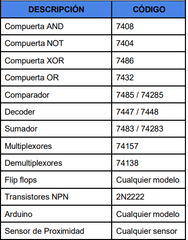

# Documentacion Practica 3 
# Laboratorio Organización Computacional
# Sección C
## Ing. FERNANDO JOSÉ PAZ GONZÁLEZ
## Aux. KEVIN ESTUARDO SECAIDA MOLINA

# Grupo 5

| Nombre                          | Carnet    | Participación |
| --------------------------------| --------- |---------------|
|JOSÉ ADRIAN OROZCO RAMÍREZ       | 202210908 |      20%      |
|---------------------------------|-----------|---------------|
|MARCOS DANIEL BONIFASI DE LEÓN   | 202202410 |      20%      |
| --------------------------------| --------- |---------------|
|KEVIN DANIEL CATÚN LANDAVERDE    | 202200378 |      20%      |
|---------------------------------|-----------|---------------|
|JULIO ALEJANDRO RUANO MONTERROSO | 202300520 |      20%      |
| --------------------------------| --------- |---------------|
|WYLSON ENRIQUE ESQUIVEL CUY      | 202105429 |      20%      |

# Introducción 
En el ámbito de la electrónica digital, el diseño y la implementación de circuitos combinacionales juegan un papel fundamental en la construcción de sistemas computacionales eficientes. En particular, la integración de bloques MSI (Medium Scale Integration) en operaciones aritméticas y lógicas permite la creación de dispositivos con una funcionalidad optimizada y de alto rendimiento.

La evolución de la tecnología ha transformado los sistemas de control y automatización, permitiendo soluciones más eficientes, seguras y organizadas. En el contexto de la asignatura de Organización Computacional, se propone la creación de un sistema automatizado de parqueo como ejercicio integrador de conocimientos en lógica combinacional y secuencial. El desarrollo de esta práctica tiene como objetivo el diseño y construcción de un prototipo funcional de una torre de parqueo inteligente, que permita el ingreso, control y salida de vehículos mediante sensores, servomotores, flip-flops, microcontroladores y dispositivos electromecánicos. Esta práctica busca no solo aplicar los conocimientos teóricos aprendidos, sino también fomentar la capacidad de resolver problemas reales mediante la Electrónica Digital.

# Descripción del problema
El hotel Grand Tikal Futura requiere un prototipo funcional de una torre de parqueo automatizada, inspirada en el modelo utilizado por su competencia en Miraflores. El sistema debe gestionar el ingreso y salida de vehículos, controlar el número de espacios disponibles por nivel (distribuidos en 3, 4 y 5 espacios respectivamente), y garantizar la seguridad mediante una garita inteligente. El ingreso será regulado mediante un sensor de proximidad que activa una barrera operada por un servomotor. El sistema debe generar un ticket con contraseña y permitir el acceso durante un intervalo de 20 segundos. La salida requerirá la validación de la contraseña. En caso de intento de robo (contraseña incorrecta), se activará una alarma y se cerrará el parqueo. Este sistema debe implementarse en Proteus, incluir el diseño físico con encapsulamiento, y cumplir con los requisitos electrónicos especificados sin utilizar componentes no autorizados.

# Objetivos 

## General
Aplicar conocimientos teóricos y prácticos para el diseño de sistemas digitales, integrando lógica combinacional y secuencial en el desarrollo de una torre de parqueo automatizada.

### Especificos
    1. Integrar lógica combinacional con lógica secuencial en un sistema funcional.
	2.	Utilizar mapas de Karnaugh para simplificar funciones booleanas.
	3.	Implementar dispositivos electromecánicos como sensores, servomotores y teclados.
	4.	Introducir el uso de microcontroladores en sistemas embebidos.
	5.	Diseñar un sistema optimizado utilizando el menor número de componentes posibles.
	6.	Resolver problemas reales mediante técnicas de Electrónica Digital.
	7.	Comprender aplicaciones prácticas de la lógica secuencial.

# Proceso Teórico

Para el diseño e implementación de las placas electrónicas y circuitos requeridos en el prototipo, se siguieron los siguientes procesos teóricos:

1. Lógica Combinacional y Mapas de Karnaugh

Se utilizaron mapas de Karnaugh para simplificar funciones booleanas necesarias en la toma de decisiones del sistema (por ejemplo, validación de contraseña, cambio de nivel al llenarse un piso, activación de alarmas, etc.). Esto permitió una reducción significativa en el uso de compuertas lógicas.

2. Flip-Flops y Contadores

Para el conteo de parqueos vacíos y llenos por nivel, se emplearon flip-flops tipo D o T conectados en forma de contadores ascendentes y descendentes. Estos contadores operan sin Arduino, cumpliendo las restricciones del proyecto.

3. Control de Barreras y Puertas

Se diseñó una placa que integra un servomotor controlado por un microcontrolador (Arduino), simulando la apertura y cierre de la barrera de entrada y salida. Adicionalmente, se implementó un puente H para el manejo de la puerta de seguridad, controlado por el mismo microcontrolador.

4. Sensor de Proximidad y Teclado Matricial

El ingreso del vehículo es detectado mediante un sensor de proximidad, el cual envía una señal al microcontrolador para activar la barrera. La salida requiere el ingreso de una contraseña a través de un teclado matricial, cuya validación permite la apertura de la garita.

5. Diseño y Simulación en Proteus

Todo el sistema fue diseñado y simulado en Proteus en un solo archivo .pdsprj, permitiendo verificar el funcionamiento lógico antes de su implementación física.

# Diagramas de los diseños desarrollados

## Contador 1

## Salidas

## Placa 3

## Placa 4

## Placa 5

# Equipo Utilizado

# Presupuesto 
## Gastos

## Aporte individual

| Nombre                          | Carnet    | Participación |
| --------------------------------| --------- |---------------|
|JOSÉ ADRIAN OROZCO RAMÍREZ       | 202210908 |    Q133.1     |
|---------------------------------|-----------|---------------|
|MARCOS DANIEL BONIFASI DE LEÓN   | 202202410 |    Q133.1     |
| --------------------------------| --------- |---------------|
|KEVIN DANIEL CATÚN LANDAVERDE    | 202200378 |    Q133.1     |
|---------------------------------|-----------|---------------|
|JULIO ALEJANDRO RUANO MONTERROSO | 202300520 |    Q133.1     |
| --------------------------------| --------- |---------------|
|WYLSON ENRIQUE ESQUIVEL CUY      | 202105429 |    Q133.1     |

# Conclusiones
    -La práctica #3 permitió cumplir de manera efectiva el objetivo general de aplicar los conocimientos teóricos adquiridos en clase para la construcción de circuitos combinacionales y secuenciales dentro de un sistema funcional. A lo largo del desarrollo del proyecto, se alcanzaron los siguientes logros:

	1.	Integración de lógica combinacional y secuencial: Se logró desarrollar un sistema completo que une ambas lógicas mediante el uso de flip-flops, contadores, sensores, y compuertas lógicas, permitiendo así la implementación de control de parqueo por niveles y validación de acceso.

	2.	Aplicación de Mapas de Karnaugh: Se utilizó la simplificación lógica mediante Mapas de Karnaugh para obtener funciones booleanas optimizadas, lo que redujo la complejidad del circuito y el número de compuertas necesarias.

	3.	Comprensión del funcionamiento de elementos electromecánicos: El uso de sensores de proximidad, servomotores, teclados matriciales y un puente H brindó un conocimiento práctico sobre la interacción entre componentes electrónicos y mecánicos en un entorno controlado.

	4.	Introducción al uso de microcontroladores: Se utilizó Arduino para gestionar eventos como el levantamiento de barreras, la validación de contraseñas y el manejo del sistema de seguridad, facilitando la automatización de los procesos críticos del sistema.

	5.	Diseño optimizado del sistema: Gracias a la planificación lógica, se logró un diseño eficiente, reduciendo el número de componentes necesarios sin comprometer la funcionalidad del sistema, y respetando las restricciones impuestas en cuanto al uso de integrados permitidos.

	6.	Resolución de problemas con Electrónica Digital: Se enfrentaron y resolvieron retos como el control de flujo de vehículos, gestión de niveles de parqueo y activación de alarmas, mediante lógica digital implementada con flip-flops y compuertas.
    
	7.	Comprensión del uso de lógica secuencial en la práctica: La práctica evidenció cómo la lógica secuencial es clave para mantener estados del sistema (como conteos y validaciones), y cómo su correcta implementación permite un control automatizado confiable y seguro.