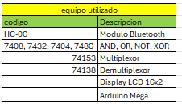
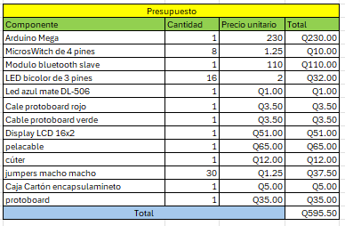
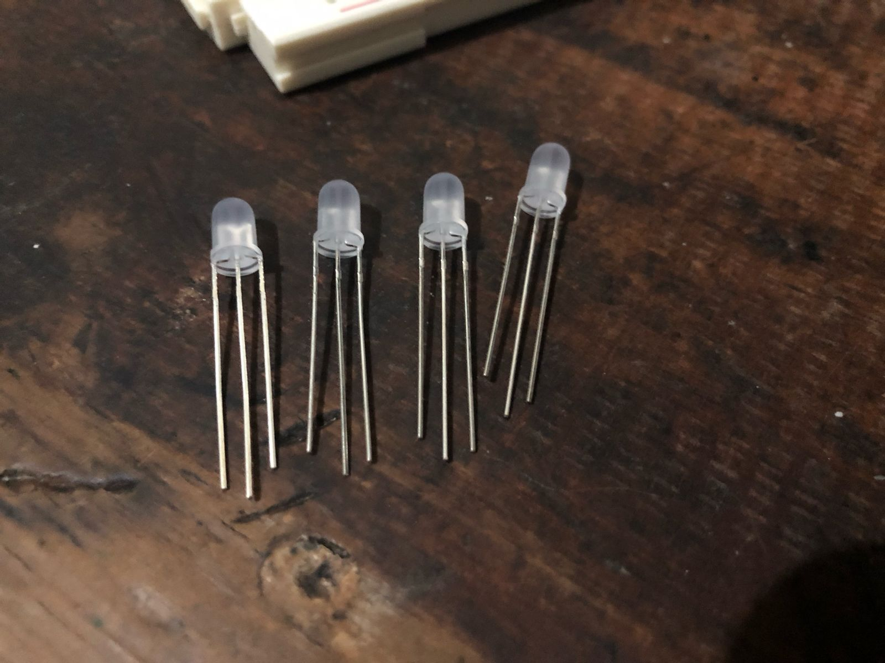

# Documentacion Proyecto Final 
# Laboratorio Organización Computacional
# Sección C
## Ing. FERNANDO JOSÉ PAZ GONZÁLEZ
## Aux. KEVIN ESTUARDO SECAIDA MOLINA

# Grupo 5

| Nombre                          | Carnet    | Participación |
| --------------------------------| --------- |---------------|
|JOSÉ ADRIAN OROZCO RAMÍREZ       | 202210908 |      20%      |
|---------------------------------|-----------|---------------|
|MARCOS DANIEL BONIFASI DE LEÓN   | 202202410 |      20%      |
| --------------------------------| --------- |---------------|
|KEVIN DANIEL CATÚN LANDAVERDE    | 202200378 |      20%      |
|---------------------------------|-----------|---------------|
|JULIO ALEJANDRO RUANO MONTERROSO | 202300520 |      20%      |
| --------------------------------| --------- |---------------|
|WYLSON ENRIQUE ESQUIVEL CUY      | 202105429 |      20%      |

# 1. Introducción 
En el contexto del curso de Organización Computacional, impartido por la Facultad de Ingeniería de la Universidad de San Carlos de Guatemala, se ha planteado como proyecto final la implementación del clásico juego “Buscaminas”, utilizando exclusivamente lógica combinacional y secuencial. Este proyecto tiene como objetivo central aplicar los conocimientos adquiridos a lo largo del semestre, integrando múltiples componentes digitales como memorias RAM construidas con flip-flops, comunicación serial a través de Arduino y módulos Bluetooth, así como la interacción entre hardware y software mediante arquitecturas cliente-servidor.

La propuesta busca no solo desarrollar un circuito funcional, sino también replicar, mediante hardware, la lógica interna de un juego interactivo que tradicionalmente es gestionado por software. Esto implica una transición del entorno virtual al físico, haciendo uso de componentes digitales que reflejan estados, operaciones y resultados en tiempo real, permitiendo así una experiencia tangible del juego. La inclusión de una memoria configurable, entradas seriales y salidas visuales (por LEDs y pantallas LCD), convierte este proyecto en un ejercicio completo de integración, diseño digital y programación embebida, fomentando tanto el trabajo colaborativo como el razonamiento lógico y técnico de los estudiantes.

# 2. Descripción del problema
El proyecto se plantea como una solicitud por parte de Microsoft Windows para desarrollar un prototipo físico del juego “Buscaminas”, que pueda ser ejecutado directamente desde un circuito digital. A diferencia de su contraparte digital convencional, este nuevo enfoque requiere que cada componente del juego (tablero, bombas, estado de juego, punteo y resultados) se represente de manera tangible mediante circuitos integrados y dispositivos electrónicos controlados por comunicación serial.

El principal desafío radica en trasladar una lógica de juego abstracta a un entorno físico, considerando la implementación de una memoria RAM personalizada de 4x4 mediante flip-flops, la validación de posiciones mediante entradas digitales, y la correcta señalización de los eventos del juego (acierto, pérdida o victoria) utilizando LEDs y mensajes en pantalla. Además, se busca habilitar la interacción remota con el circuito mediante una interfaz web y conexión Bluetooth, permitiendo configurar las posiciones de las bombas desde un computador o móvil antes de iniciar la partida.

Este escenario impone restricciones técnicas que obligan al estudiante a comprender profundamente el diseño de circuitos secuenciales, manejo de estados, programación de microcontroladores y protocolos de comunicación. La correcta coordinación entre software y hardware, junto con el control preciso de los flujos lógicos, constituyen los aspectos clave para resolver este problema de manera satisfactoria.

# 3 Objetivos 

## 3.1 General
Aplicar de manera práctica los conocimientos adquiridos en lógica combinacional y secuencial para desarrollar un sistema digital funcional que replique el juego “Buscaminas”, integrando memoria RAM, comunicación serial y módulos de interacción hardware/software.

### 3.2 Especificos
3.2.1 Diseñar e implementar circuitos secuenciales y combinacionales usando componentes digitales básicos como flip-flops, multiplexores y puertas lógicas.

3.2.2 Construir una memoria RAM de 4x4 mediante flip-flops, con capacidad de configuración previa al inicio del juego.

3.2.3 Desarrollar la comunicación serial entre una interfaz web y el sistema físico utilizando Arduino y módulo Bluetooth.

3.2.4 Simular la lógica de juego con estados definidos: jugando, victoria y game over, reflejados en un sistema de indicadores LED y pantalla LCD.

3.2.5 Implementar una arquitectura cliente-servidor para gestionar la configuración y ejecución del juego desde una plataforma externa (PC o móvil).

3.2.6 Promover el uso de buenas prácticas en el control de versiones a través de ramas main, dev y feature, asegurando la colaboración efectiva de todos los integrantes del equipo.

# 4 Proceso Teórico

El desarrollo del proyecto “Buscaminas” en su versión física implementada con lógica combinacional y secuencial representa un reto de integración de múltiples áreas del diseño digital, tales como construcción de memorias, comunicación serial, arquitectura de sistemas embebidos y lógica de control de estados. A continuación, se detallan los fundamentos teóricos en los que se basa cada componente del sistema:

4.1 Memoria RAM Implementada con Flip-Flops
La memoria RAM (Random Access Memory) es una estructura de almacenamiento volátil que permite la lectura y escritura de datos binarios. En este proyecto, se implementa una memoria RAM de 4x4 (16 bits) utilizando flip-flops tipo D. Los flip-flops son elementos básicos de almacenamiento secuencial que almacenan un bit de información por unidad. Para construir esta RAM se consideran:

Flip-flops tipo D (74174 o 74374): permiten almacenar el valor de entrada (D) en el flanco de subida del reloj.

Multiplexores y decodificadores: necesarios para direccionar correctamente las celdas de memoria a leer o escribir.

Señal de control de escritura: que determina cuándo un dato debe ser almacenado en la RAM.

Cada posición de la memoria se corresponde con una coordenada del tablero de juego, y almacena un bit que indica si hay o no una bomba (1 = bomba, 0 = vacío).

4.2 Comunicación Serial (UART) con Arduino
La comunicación serial permite transmitir información bit a bit a través de un canal común. En este proyecto, se utiliza un módulo HC-06 Bluetooth, el cual actúa como puente entre el dispositivo móvil o PC del usuario y el Arduino, que gestiona la lógica de entrada/salida hacia el circuito físico. La comunicación sigue el protocolo UART:

Tx/Rx: líneas de transmisión y recepción que comunican el HC-06 con el Arduino.

Baudrate (9600 bps recomendado): velocidad de transferencia de datos.

Comandos: el sistema espera comandos como configuración (config), posiciones (1-16), y control (reinicio) que son interpretados y enviados a los componentes lógicos del circuito.

4.3 Lógica del Juego y Estados Finito Determinístico (FSM)
La lógica del juego se modela con una máquina de estados finita, que transiciona entre distintos estados según las acciones del jugador. Los tres estados principales son:

Jugando (azul): estado activo donde el jugador puede enviar posiciones.

Game Over (rojo): estado de pérdida al seleccionar una bomba.

Ganador (verde): estado alcanzado al verificar todas las casillas sin bombas.

Cada transición depende de la lectura de la RAM en la posición seleccionada. Se controla mediante una lógica secuencial que activa LEDs e instrucciones en pantalla según el estado alcanzado.

4.4 Visualización de Estado y Resultado
Se utilizan varios mecanismos para indicar al jugador el progreso del juego:

Pantalla LCD 16x2: muestra mensajes de estado como "Jugando", "Game Over", o "Ganaste".

LEDs tricolores: un LED azul indica estado activo, rojo indica pérdida y verde victoria.

Contador de aciertos: cada acierto incrementa un contador visualizado en pantalla.

Estos elementos están conectados directamente a las salidas lógicas del sistema, que responden a las acciones del jugador en tiempo real.

4.5 Arquitectura Cliente-Servidor y Control de Flujo
El sistema está diseñado bajo una arquitectura cliente-servidor:

Cliente: interfaz web desarrollada por el estudiante, desde donde se configuran las bombas y se envían comandos.

Servidor: Arduino que interpreta las señales y coordina la ejecución en el circuito.

Durante la configuración, el servidor (Arduino) no permite iniciar el juego hasta que la RAM haya sido completamente cargada con la posición de las bombas, validando así el correcto flujo del sistema.

4.6 Manejo del Repositorio y Control de Versiones
El uso de control de versiones Git es parte fundamental del proceso de desarrollo colaborativo:

Rama main: contiene solo las versiones finales listas para despliegue.

Rama develop: rama de integración de nuevas características.

Ramas feature/*: donde cada estudiante desarrolla funcionalidades individuales.

Se exige un etiquetado adecuado y participación activa de cada integrante, con al menos un commit documentado por miembro en la rama correspondiente, fomentando así el trabajo organizado y colaborativo.

4.7 Componentes Lógicos y Electrónicos Utilizados
ICs lógicos: 7408 (AND), 7432 (OR), 7404 (NOT), 7486 (XOR) para la lógica combinacional.

74153 (MUX) y 74138 (DEMUX): para direccionamiento en la memoria RAM.

Pantalla LCD 16x2: interfaz de texto.

HC-06: módulo Bluetooth serial.

Arduino Uno: unidad de procesamiento intermedio entre el frontend y el hardware.

# 5.Equipo Utilizado

# 6. Presupuesto 
## 6.1 Gastos

## 6.2 Aporte individual

| Nombre                          | Carnet    | Participación |
| --------------------------------| --------- |---------------|
|JOSÉ ADRIAN OROZCO RAMÍREZ       | 202210908 |    Q99     |
|---------------------------------|-----------|---------------|
|MARCOS DANIEL BONIFASI DE LEÓN   | 202202410 |    Q200.00     |
| --------------------------------| --------- |---------------|
|KEVIN DANIEL CATÚN LANDAVERDE    | 202200378 |    Q99     |
|---------------------------------|-----------|---------------|
|JULIO ALEJANDRO RUANO MONTERROSO | 202300520 |    Q99     |
| --------------------------------| --------- |---------------|
|WYLSON ENRIQUE ESQUIVEL CUY      | 202105429 |    Q99     |

# 7. Conclusiones
La realización del proyecto “Buscaminas” representa una oportunidad única para consolidar y aplicar los conocimientos adquiridos en el área de Organización Computacional, trasladando conceptos teóricos al ámbito práctico. La implementación de componentes como flip-flops, multiplexores y módulos de comunicación permite que los estudiantes enfrenten retos reales de diseño digital, fortaleciendo sus habilidades en resolución de problemas, trabajo en equipo y manejo de tecnologías embebidas.

Asimismo, la integración entre la arquitectura hardware y el control desde una plataforma software remota (interfaz web conectada a través de Arduino y Bluetooth) refuerza la comprensión de los principios de comunicación serial, modularidad del sistema y diseño orientado a eventos. Esta convergencia de tecnologías permite no solo simular un juego, sino diseñar una arquitectura robusta y funcional que responde a entradas humanas en tiempo real.

El cumplimiento estricto de los lineamientos establecidos, tanto técnicos como organizativos (uso de repositorios Git, ramas de desarrollo, documentación técnica), asegura que el proyecto no solo sea funcional, sino también profesional, replicando condiciones del entorno laboral y fomentando prácticas correctas en ingeniería de software y hardware.

Finalmente, este proyecto demuestra que el aprendizaje significativo ocurre cuando los conceptos se aplican en contextos creativos y desafiantes, haciendo del desarrollo de este sistema una experiencia formativa integral.

# 8. Recomendaciones

1. Validar completamente la RAM antes de iniciar el juego: se recomienda implementar una rutina de verificación que compruebe que las posiciones de bomba han sido correctamente almacenadas antes de jugar.

2. Optimizar la interfaz de configuración (frontend): que sea intuitiva, visual y validada para evitar errores de entrada por parte del usuario.

3. Depurar la comunicación serial constantemente: implementar protocolos de confirmación entre la interfaz y el Arduino para asegurar que los comandos se procesan correctamente.

4. Incluir indicadores de estado de conexión y funcionamiento: LEDs o mensajes en pantalla para señalar si la conexión está activa y si el sistema está listo para jugar.

5. Gestionar adecuadamente el repositorio Git: utilizar buenas prácticas en el uso de ramas y commits, promoviendo trazabilidad y organización en el desarrollo.

6. Implementar pruebas en simuladores antes del montaje físico: simular la lógica digital permite detectar errores sin poner en riesgo los componentes.

7. Documentar con evidencia visual: incluir fotos, capturas de pantalla y logs de prueba que respalden cada fase del desarrollo.

8. Distribuir responsabilidades equitativamente: asegurando que todos los miembros participen activamente en el desarrollo de una parte crítica del sistema.

9. Planificar sesiones de integración progresiva: integrar por módulos y validar funcionalidad parcial en cada etapa del desarrollo.

10. Preparar documentación clara: tanto el manual técnico como el de usuario deben incluir pasos detallados y resolución de errores comunes.

# 9. Anexos

LEDS quemados: 

LINK VIDEO EXPLICATIVO PROYECTO FINAL:
https://youtu.be/RoREA14uA2Y?si=PRd9PNsU9wK67K3V