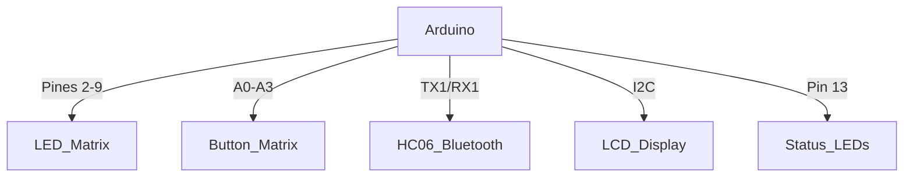
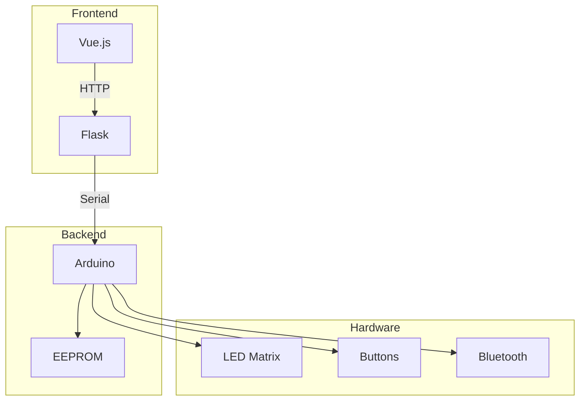
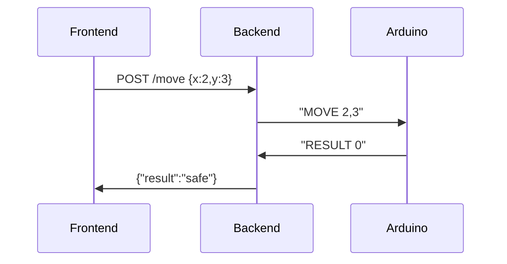

# 🛠️ Manual Técnico - Minesweeper Circuit

## 📖 Tabla de Contenidos
1. [Cómo Ejecutar el Proyecto](#-cómo-ejecutar-el-proyecto)
2. [Especificaciones Técnicas](#-especificaciones-técnicas)
3. [Diagramas de Circuito](#-diagramas-de-circuito)
4. [Arquitectura del Sistema](#-arquitectura-del-sistema)
5. [Protocolos de Comunicación](#-protocolos-de-comunicación)
6. [Código Arduino](#-código-arduino)
7. [Backend Flask](#-backend-flask)
8. [API Reference](#-api-reference)
9. [Flujo de Datos](#-flujo-de-datos)
10. [Guía de Depuración](#-guía-de-depuración)
11. [FAQ Técnica](#-faq-técnica)

## 🚀 Cómo Ejecutar el Proyecto

### Frontend (Vue.js)
```bash
# Instalar dependencias
yarn install

# Ejecutar servidor de desarrollo
yarn dev
```

### Backend (Flask)
```bash
# Crear entorno virtual
python3 -m venv env

# Activar entorno (Linux/Mac)
source ./env/bin/activate

# Instalar dependencias
pip3 install -r requirements.txt

# Ejecutar servidor
python3 app.py
```

### Solución de Problemas
```bash
# Verificar puerto Arduino (MacOS)
ls /dev/cu.*

# Matar procesos bloqueando el puerto
lsof /dev/cu.usbmodem11401
kill -9 <PID>
```

## 🔧 Especificaciones Técnicas

### Hardware
| Componente | Especificaciones | Interface |
|------------|------------------|-----------|
| Arduino Mega 2560 | ATmega2560, 16MHz | USB 2.0, UART |
| HC-06 Bluetooth | SPP, 2.4GHz | UART (115200 baud) |
| Matriz LED 4x4 | LED Rojo 5mm, 20mA | GPIO Multiplexado |
| Botones 4x4 | Tact Switch 6x6mm | Matriz de entradas |

### Software
| Componente | Versión | Dependencias Clave |
|------------|---------|-------------------|
| Vue.js | 3.2.47 | Vuetify, Axios |
| Flask | 2.2.3 | Flask-CORS, PySerial |
| Arduino IDE | 1.8.19 | EEPROM, SoftwareSerial |

## 🔌 Diagramas de Circuito

### Conexiones Principales


### Esquema Matriz LED/Botones
```
        C1   C2   C3   C4
      +----+----+----+----+
R1 | LED1| LED2| LED3| LED4|
      +----+----+----+----+
R2 | LED5| LED6| LED7| LED8|
      +----+----+----+----+
      ... (4x4 grid)
```

## 🏗️ Arquitectura del Sistema



## 📡 Protocolos de Comunicación

### Comandos Serial
| Comando | Formato | Ejemplo |
|---------|---------|---------|
| ADD_BOMB | `B,x,y` | `B,2,3` |
| GET_STATE | `STATE?` | - |
| RESET | `RST` | - |

### Estructura JSON
```json
{
    "bombs": [
        {"x":1, "y":2},
        {"x":3, "y":4}
    ],
    "game_mode": "expert"
}
```

## 🔌 Código Arduino

### Estructura Principal
```cpp
void setup() {
    Serial.begin(9600);  // USB Debug
    Serial1.begin(9600); // Bluetooth
    
    // LED Matrix Setup
    for(int i=0; i<4; i++) {
        pinMode(rows[i], OUTPUT);
        pinMode(cols[i], OUTPUT);
    }
    
    // Keypad Setup
    for(int i=0; i<4; i++) {
        pinMode(keypadRows[i], OUTPUT);
        pinMode(keypadCols[i], INPUT_PULLUP);
    }
}
```

### Mapa EEPROM
| Dirección | Contenido | Tamaño |
|-----------|-----------|--------|
| 0x000-0x001 | Bomb Count | 2 bytes |
| 0x002-0x00F | Bomb Data | 14 bytes |
| 0x010-0x013 | Current Score | 4 bytes |

## 🐍 Backend Flask

### Endpoints Clave
```python
@app.route('/game/play.json', methods=['POST'])
def play_game():
    mode = request.json['game_mode']
    Ram.play_game(mode)
    return jsonify({"status": "success"})
```

### Manejo de Errores
```python
@app.errorhandler(404)
def not_found(e):
    return jsonify({
        "status": "error",
        "message": "Endpoint no encontrado"
    }), 404
```

## 📡 API Reference

| Método | Endpoint | Descripción |
|--------|----------|-------------|
| POST | /game/play.json | Iniciar juego |
| POST | /bombs/add.json | Añadir bomba |
| GET | /game/state.json | Estado actual |

## 🌊 Flujo de Datos



## 🐛 Guía de Depuración

### Problemas Comunes
1. **Conexión Serial**
   - Verificar baud rate (9600)
   - Revisar cables RX/TX

2. **HC-06 Bluetooth**
```bash
AT+NAME=Minesweeper
AT+BAUD=9600
```

## ❓ FAQ Técnica

**Q: ¿Cómo cambiar el tamaño de la matriz?**
- Modificar:
  1. Pines en `setup()`
  2. Mapeo EEPROM
  3. Configuración frontend

**Q: ¿Se puede usar WiFi en lugar de Bluetooth?**
- Sí, reemplazar HC-06 por módulo ESP-01