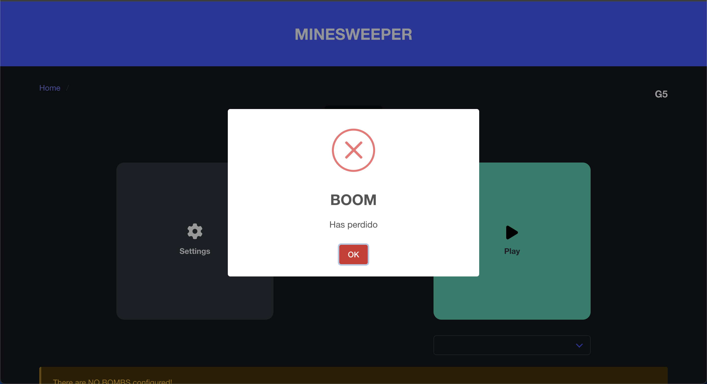
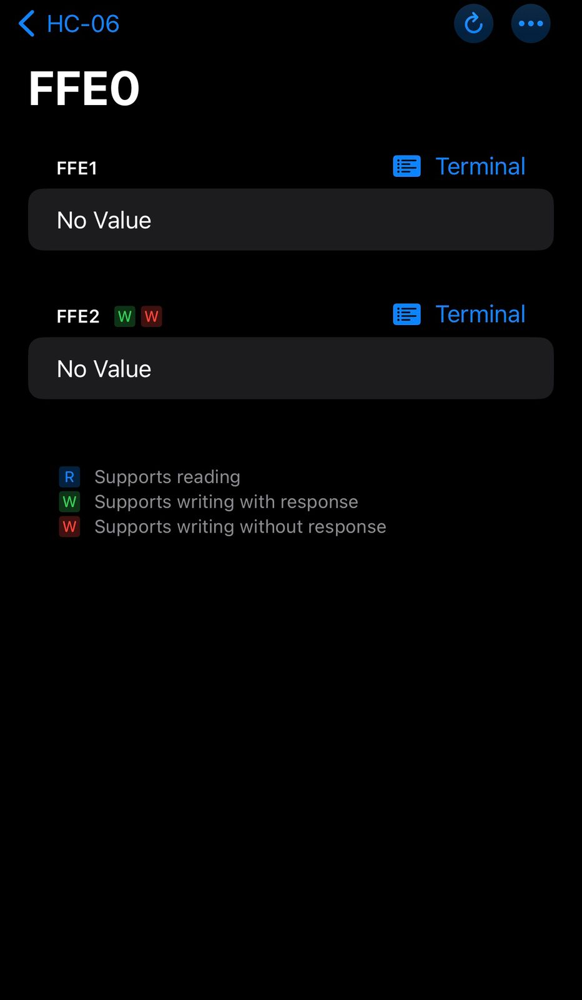

# **Manual de Usuario Proyecto Organizacion Computacional**

## - Entorno Operativo

El proyecto puede ser utlizado si tiene instalado python, ademas de ello debe tener un Arduino y dentro del mismo tener ya cargado el codigo para que no genere errores en ejecucion.

## **Funcionamiento del Programa**

## Interfaz Principal
   
   Como ventana principal tenemos la siguien vista:

   

    En esta vista tendremos 2 opciones, las cuales vienen siendo

   * Settings

    Esta es la parte en la cual podra configurar las bombas o trampas que se configurararn durante la partida.

    

   * Play

    El usuario podra jugar, interactuando con una interfaz simple para que el usuario no tenga que perder mas tiempo e ir al juego.

Posteriormente se mostraran las acciones a mas detalle de ambas opciones.

### 1. Settings

Al ir a la opcion de settings, al usuario se le mostrara la siguiente vista:

En esta vista se puede visualizar los botones que vienen formando una matriz de 4x4.

#### - Configuracion Manual
Si usted presiona cada boton, se ira marcando en rojo, y en esa posicion se estaria configurando una "bomba".

y como confirmacion se le mostrara un mensaje como el siguiente.

#### - Configuracion por carga de Archivo
Ademas de poder configurar las bombas manualmente, puede realizar la carga de un archivo **".org"**, si observa detenidamente puede ver este boton en la parte superior Derecha.

   Al presionar este boton, se le mostrara la siguiente ventana en la cual debe seleccionar el archivo.

Como confirmacion se le mostrara un mensaje como el siguiente.

### 2. Play

Si usted como usuario desea jugar, primero debe tener configuradas las bombas en el tablero.

"Vea el inciso **1** para poder realizarlo o que el encargado lo realize."

Si usted por alguna razon no tiene configuradas las bombas previamente, se le notificara con un mensaje.

En caso tenga todo configurado, se le mostrara la siguiente vista.

   
 
Aca puede observar que tiene 16 botones, en los cuales usted podra presionar cualquiera.

Si su eleccion no contiene una bomba, se le marcara en verde el boton y podra seguir presionando los botones.

   

#### 2.1 Ganar partida

Si usted termina de seleccionar evita seleccionar las bombas, ganara la partida, y se le mostrara un mensaje.
   

####  2.2 Perder Partida

Si usted por alguna razon seleciona entre todas las posibilidades una bomba, habra perdido la partida, y se le mostrara un mensaje.

   

 

# Parte Fisica

## Bluetooth

La aplicacion que se utiliza para poder enlazar la parte del fisica en computadora con un celular viene siendo **"Bluetooth"**, especificamente **"BluetoothLE"**

### Realizar la conexion

Para poder conectar el arduino con el celular en la app de "BluetoothLE", se le mostrara el siguiente menu.

En este caso debe conectarse en el "HC-06", el cual viene siendo el arduino.

Una vez conectado entra y se le mostrara la siguiente informacion del dispositivo.

Donde vien el nombre, como direccion del dispositivo(UUID) y la señal que tiene el dispositivo (RSSI).

En la parte de "Services" en la parte inferior, debe seleccionar "FFE0"

Se le mostrara la siguiente configuracion.

Aca selecciona la termina "FFE2".

Al seleccionar esta terminal se le mostrara el siguiente menu.

En esta ultima ventana usted podra ingresar las Coordenadas de boton para poder interactuar con el juego.

## Por ejemplo:

Si uste desea ingresar la posicion del primer boton, esta deberia ser
0,0

si usted desea ingresar la posicion de ultimo boton de la columna 2, la coordenada correcta es 3,2.

Pero si usted quiere ingresar la posicion del segundo boton de la ultima columna, lo correcta vendria siendo 1,3 y no la coordenada 2,4 ya que esa posicion no existe en la matriz.

Es cuestion que vea la matriz empezando de 0 tanto en filas como en columnas.

 

## Jugabilidad y visualizacion de resultados fisicamente

La conexion serial se realiza por medio de un cable entre el ordenador y el arduino.

Usted como usuario tendra visualmente la matriz realizada con led rojos y una pantalla LCD.

y ademas tendra 3 luces leds que le mostraran los acontecimientos de la partida.

Los acontecimientos vendran siendo:

- Led azul

Indica que la partida esta en curso, esta se mantiene encendida mientras este jugando.

- Led roja

Indica que perdio la partida

- Lez verda

Indica que gano la partida

Para interactuar con el juego puede presionar los botones.

Estos estan implementados de la misma forma, una matriz de 4x4 y siempre siguiendo el concepto de las coordenadas mencionado en la parte del "bluetooth"

Al finalizar la partida se resetea el juego para volver a los estados iniciales y asi volver a configurar las bombas.

 

Realizado por:

**Grupo 5  Organizacion Computacional 1S2025**

